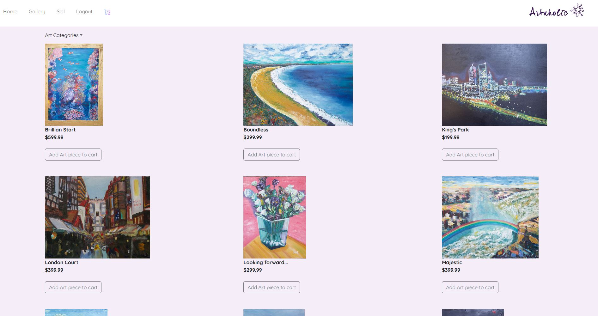

# Artaholics
[](https://opensource.org/licenses/MIT)

## Description <br>
Artaholics is an art store created with React. It utillizes JWT to handler user logins. To handle user payments it uses stripe platform. It is a platfor to allow artists to upload their art for sale. User can go on the site to view all the art in the gallery. If they like the art then they can add to the cart.

<br>
[Live Deployment on](https://artaholics.herokuapp.com)


## Table of Contents
[Installation](#Installation)<br>
[Usage](#Usage)<br>
[License](#Artaholics)<br>
[Contributing](#Contributing)<br>
[Contributors](#Contributors)<br>
[Questions](#Questions)<br>
    

## Installation
To install the application users first need to clone the repository to the desired location.
- While in the root directory of the project, run the following command to install all the dependencies.
```
npm install
```
- To build the client side of the application run the following command:
```
npm run build
```
- To populate the database with seeds
```
npm run seed
```
- To run the server and client concurrently
```
npm run develop
```
- To run the app only
```
npm run start
```
## Usage
To use the application, Users must first create an account, or login.
<br>

Once they create an account, users can then see the sell tab.
<br>

Users can view all the art in the gallery
<br>

If a user wants to post their art for sale they can fill out the sell form
<br>

In the cart page, Users can checkout for all of the art in the cart or remove them.
<br>

If a user wants to checkout, they can pay through the stripe platform.
<br>


## Contributing
To contribute to the application, developers can fork or clone the project. For any bug fixes please create a pull request. For anny issues, please create a issue in github.

## Contributors
[Dempleon](https://github.com/Dempleon) [LinkedIn](https://www.linkedin.com/in/daryl-empleo/)<br>
[Ahhyaya](https://github.com/Ahhyaya) [LinkedIn](www.linkedin.com/in/gao-ruihan)<br>
[Yingyliu](https://github.com/yingyliu) [LinkedIn](https://www.linkedin.com/in/ying-ying-l-5865a4136/ )<br>
[Angellyn218](https://github.com/Angellyn218) [LinkedIn](https://www.linkedin.com/in/angel-cervantes-294449167/)<br>


## Questions
If you have any questions about the repo, open an issue or contact me directly at [Dempoleon@gmail.com](Dempoleon@gmail.com) or any of the contributors.
You can find more of my work at [Dempleon](https://github.com/Dempleon)


